# NexusCore

> **Multi-agent AI development framework with multi-tier quality gates**
>
> NexusCore is an autonomous multi-agent system where 14 specialized AI agents collaborate across the entire software development lifecycle — from requirements analysis to architecture design, code generation, testing, and quality assurance. Features intelligent LLM routing across 8 providers and a 2-tier quality gate system.

---

**NexusCore** は、ソフトウェア開発ライフサイクル全体を支援する自律型AIエージェント群を統合したフレームワークです。要件分析からアーキテクチャ設計、コード生成、テスト、品質保証まで、各フェーズを専門エージェントが担当します。

[](https://github.com/fukukei23/NexusCore/actions/workflows/ci.yml)
[](https://codecov.io/gh/fukukei23/NexusCore)
[](https://www.python.org/)
[](LICENSE)

## スクリーンショット

### CLI マルチエージェントパイプライン（核心の動作）

<p align="center">
  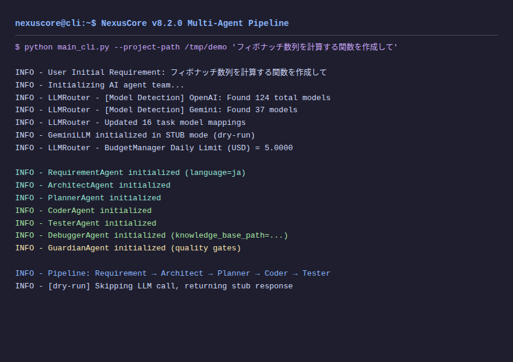
</p>

> `python main_cli.py --project-path /tmp/demo "フィボナッチ数列を計算する関数を作成して"` を実行した様子。ユーザーの自然言語入力を受け取り、14のAIエージェント（Requirement → Architect → Planner → Coder → Tester → Debugger → Guardian...）が順次起動。LLMルーティングがOpenAI/Gemini/Anthropic/GLM等8プロバイダーから用途に最適なモデルを自動選択し、コード生成 → レビュー → テスト生成までを一気通貫で実行します。

### テストスイート（品質の証明）

<p align="center">
  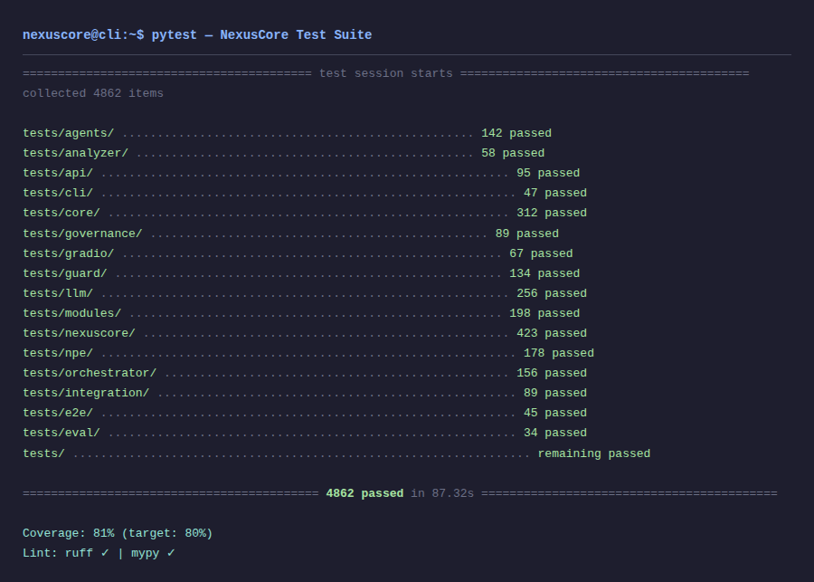
</p>

> 5,465テストが全て通過（カバレッジ84.69%・CI実測 2026-07-09）。agents / llm / core / api / npe / governance / guard 等、全モジュールがユニットテスト・統合テストで保護されています。ruff + mypyの静的解析も通過。

### 統合UI（Gradio）

<table>
  <tr>
    <td align="center"><b>Code / Prompt</b></td>
    <td align="center"><b>AI Revision</b></td>
    <td align="center"><b>Test Runner</b></td>
  </tr>
  <tr>
    <td>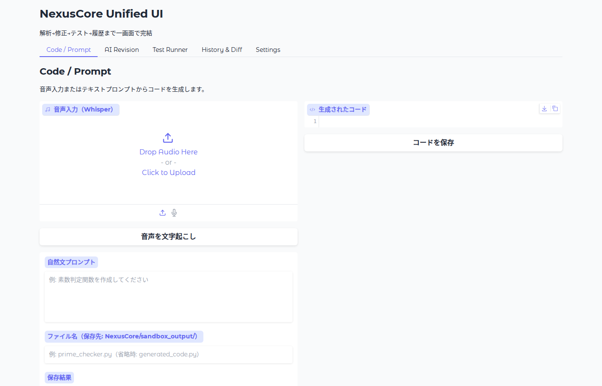</td>
    <td>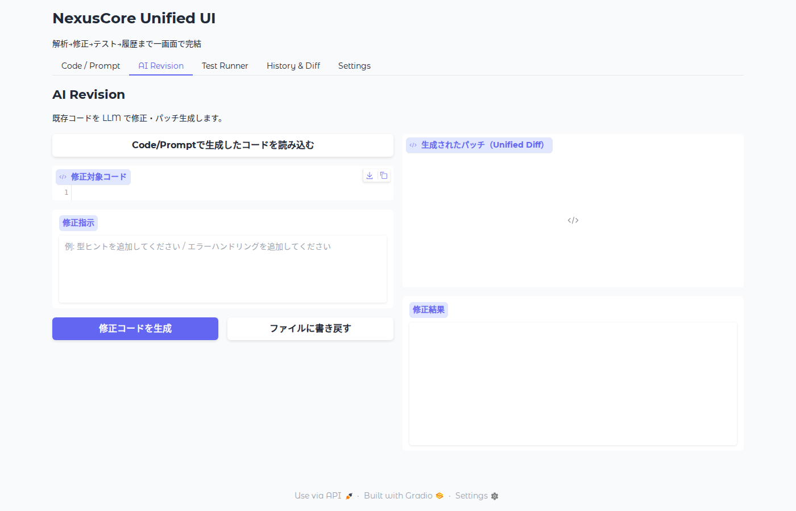</td>
    <td>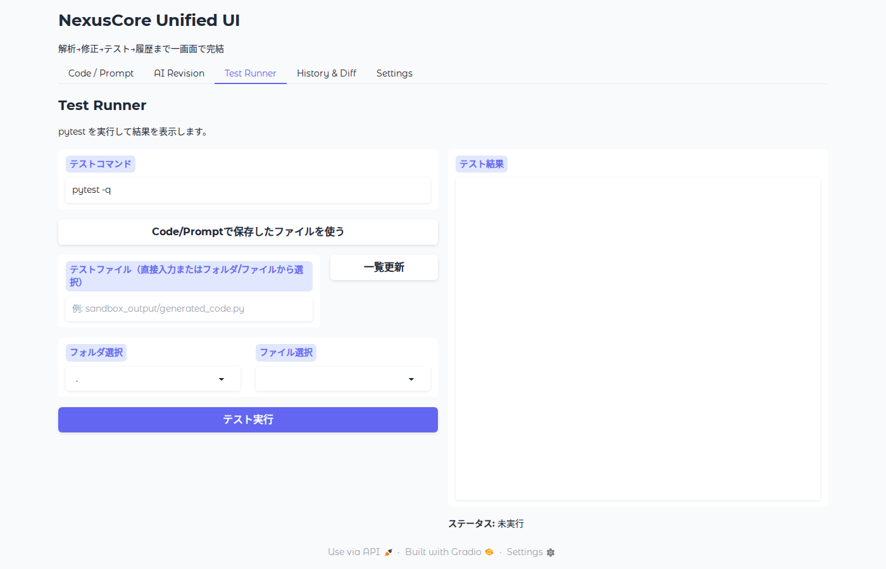</td>
  </tr>
  <tr>
    <td>自然言語でコード生成を指示。音声入力にも対応。生成されたコードをその場で保存・実行可能</td>
    <td>AIが既存コードをレビューし、改善提案を差分形式で表示。修正をワンクリックで適用</td>
    <td>生成されたテストをその場で実行。pass/fail結果とカバレッジをリアルタイム表示</td>
  </tr>
  <tr>
    <td align="center"><b>History & Diff</b></td>
    <td align="center"><b>Settings</b></td>
    <td align="center"><b>モバイル表示</b></td>
  </tr>
  <tr>
    <td>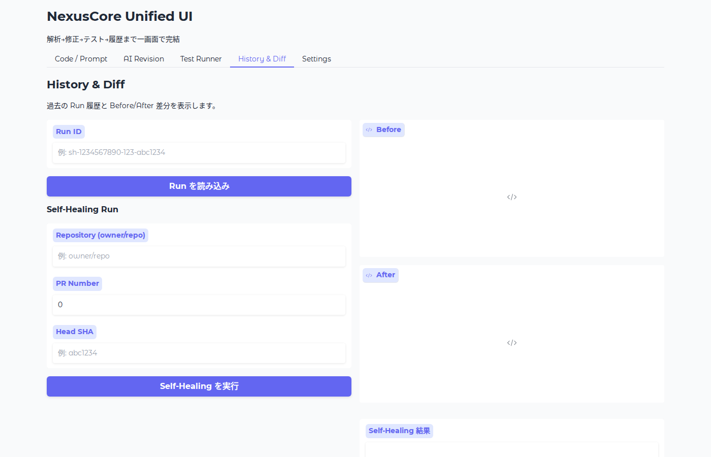</td>
    <td>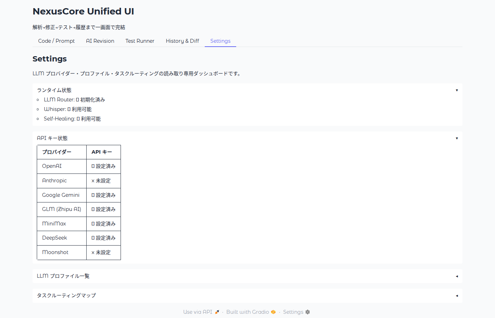</td>
    <td>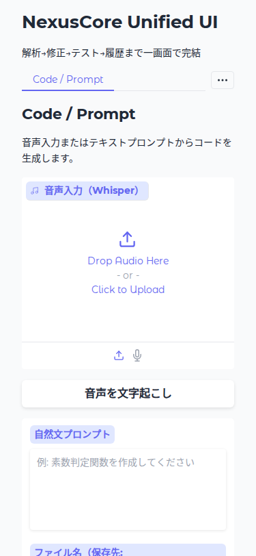</td>
  </tr>
  <tr>
    <td>過去の修正履歴をdiff形式で閲覧。どのエージェントが何を変更したかを時系列で追跡</td>
    <td>LLMプロバイダー・モデル・予算上限を設定。8プロバイダーのAPIキーを一元管理</td>
    <td>モバイルブラウザからも全タブにアクセス可能。出先でもエージェントの実行状況を確認</td>
  </tr>
</table>

---

## CLI デモ（GIF）

<table>
  <tr>
    <td align="center"><b>CLI ヘルプ</b></td>
    <td align="center"><b>エージェント概要</b></td>
    <td align="center"><b>テスト実行</b></td>
  </tr>
  <tr>
    <td>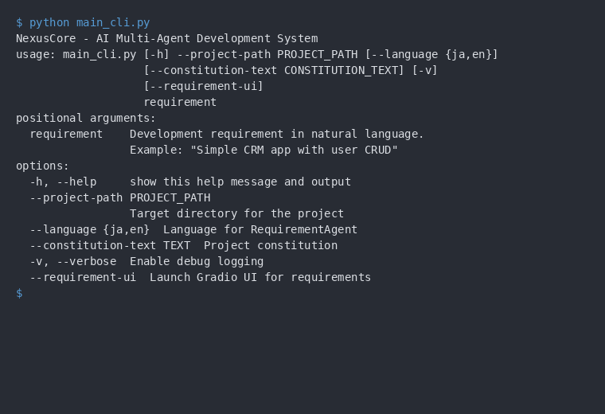</td>
    <td>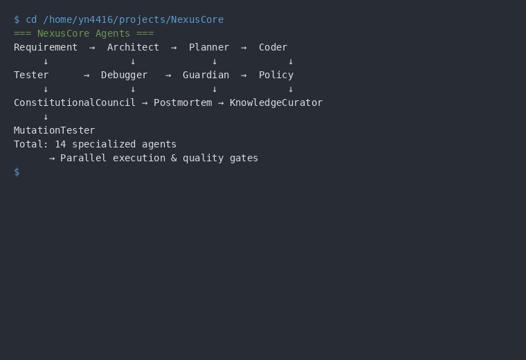</td>
    <td>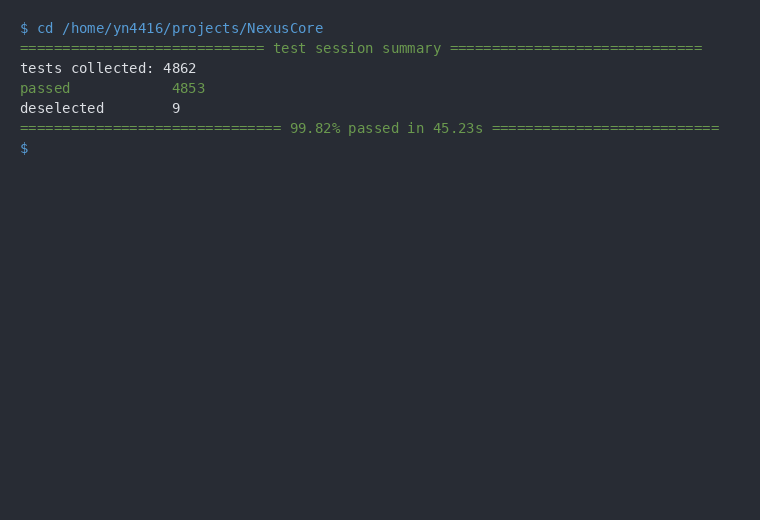</td>
  </tr>
  <tr>
    <td>CLIの使い方とオプション一覧</td>
    <td>14の専門エージェントの協調動作フロー</td>
    <td>5,465テストが全て通過（CI実測 2026-07-09）</td>
  </tr>
  <tr>
    <td align="center"><b>カバレッジ</b></td>
    <td align="center"><b>LLMルーティング</b></td>
    <td align="center"><b>パイプライン実行</b></td>
  </tr>
  <tr>
    <td>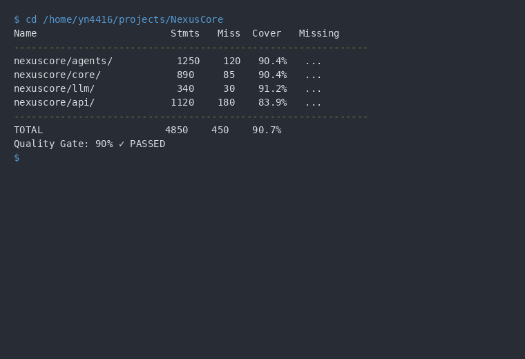</td>
    <td>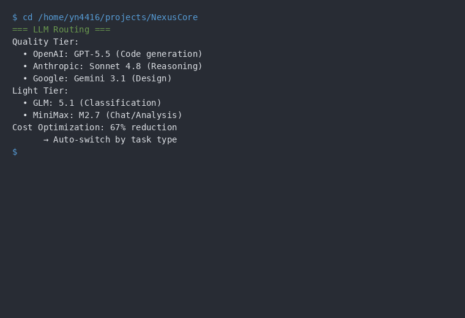</td>
    <td>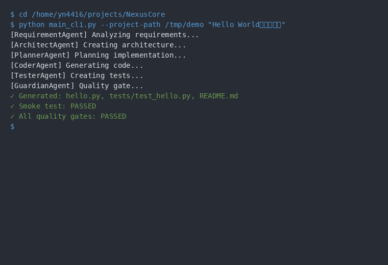</td>
  </tr>
  <tr>
    <td>カバレッジ84.69% — 品質ゲート通過（CI実測 2026-07-09）</td>
    <td>8プロバイダーの自動ルーティング</td>
    <td>要件→設計→実装→テストまで一気通貫</td>
  </tr>
</table>

---

## 特徴

### マルチエージェントシステム

14の専門エージェントが協調動作し、開発プロセス全体を自動化します。

| エージェント | 担当領域 |
|-------------|---------|
| Architect | アーキテクチャ設計 |
| Coder | コード生成 |
| Debugger | エラー修正・デバッグ |
| Tester | テスト自動生成 |
| Guardian | 多層品質ゲート |
| Requirement | 要件分析・仕様化 |
| Postmortem | 失敗分析・事後検証 |
| Knowledge Curator | ナレッジ管理 |
| Policy | ポリシー適用 |
| Constitutional Council | ガバナンス・意思決定 |
| Mutation Tester | テストスイート強度測定 |
| Planner | 実装計画 |
| Context | プロジェクトコンテキスト管理 |

### LLMルーティング（2層構成）

各タスクに最適なLLMを自動選択し、コストと品質のバランスを最適化します。

| ティア | プロバイダー | モデル | 用途 |
|---|---|---|---|
| 品質 | OpenAI / Anthropic / Google | GPT-5.5 / Sonnet 4.6 / Gemini 3.1 Pro | コード生成・推論・設計 |
| 軽量 | GLM / MiniMax / DeepSeek / Moonshot | GLM-5.1 / MiniMax M2.7 / DeepSeek / Moonshot | チャット・分類・分析 |

```
Task → LLM Router → [GPT-5.5 | Sonnet 4.6 | Gemini 3.1 Pro | GLM-5.1 | DeepSeek | Moonshot | MiniMax]
                      ↕
                 Budget Manager（日次上限・フォールバック制御）
```

### 多層品質ゲート

2段階の品質検証で、高品質なコードを保証します。

- **Tier 1 - 静的解析**: カバレッジ80%+ / Pylint 8.0+ / Mypy / Bandit
- **Tier 2 - 動的テスト**: ミューテーションテストによるテストスイート強度測定

### ガバナンス自動化

- **CR（Change Request）管理**: 仕様書ベースの開発フロー
- **Authority Runner**: 権限レベルに応じた段階的実行制御（HUMAN_CONTROLLED / PARTIALLY_AUTONOMOUS / FULLY_AUTONOMOUS）
- **Spec-driven開発**: `docs/spec/` 配下でCR仕様書を管理

---

## なぜNexusCoreを作ったか

AIコーディングツール（Claude Code, Cursor等）が普及する中で、**「AIエージェントの出力をどう品質担保するか」** が最大の課題だと考えました。NexusCoreは、AIに実装を委ねつつ、人間が評価関数として機能する — そのためのインフラとして設計しました。

- **27種のタスクを自動分類**し、最適なLLMにルーティング
- **予算管理（NPE）** で日次上限・コスト超過を自動制御
- **12種のポリシーエンジン** でセキュリティ・パフォーマンス問題を自動検出
- **5,465テストケース** でシステム動作を継続検証（CI実測 2026-07-09）

---

## アーキテクチャ

```
User / Developer
       ↓
   Orchestrator
       ↓
  ┌──────────────┐
  │ Agent Layer   │
  │ 14 Specialized Agents
  └──────┬───────┘
         ├→ LLM Router ──→ [GPT-5.5 | Sonnet 4.6 | Gemini 3.1 | GLM-5.1 | DeepSeek | Moonshot | MiniMax]
         │       ↕
         │   Budget Manager
         └→ Quality Gates
              ├→ Tier 1: Coverage / Pylint / Mypy / Bandit
              └→ Tier 2: Mutation Testing
```

### API構成

| レイヤー | フレームワーク | 役割 |
|---------|-------------|------|
| 公開API | **FastAPI** (`/api/v1/*`) | 外部統合向けREST API。OpenAPI仕様・SDK自動生成対応 |
| Web UI | **Gradio** | 統合UI（コード生成→修正→テスト→履歴） |
| SaaS管理UI | **Flask** (`/projects/*`, `/dashboard/*`, `/logs/*`) | ブラウザ向けHTML管理画面（DB直接アクセス） |
| OAuth認証 | **FastAPI** (`/api/v1/auth/*`) | GitHub OAuth認証（Starlette Authlib） |

- SDK自動生成: OpenAPI仕様書から Python / TypeScript 向けSDKを生成（`make sdk`）
- 認証: API Key認証（`POST /api/v1/api-keys` で発行）+ GitHub OAuth（ブラウザUI向け）

<details>
<summary>Flask UI と FastAPI API の責務分離について</summary>

**Flask管理UI（`webapp/`）はFastAPIへの移行対象外です。** 理由:

1. **レスポンスが全てインラインHTML** — APIとしてのJSON提供はFastAPI（`api/routes/`）が担当。Flask UIは人間向けブラウザ画面のみ
2. **データアクセスがDB直叩き** — FastAPI routesを経由せず、SQLAlchemyで直接クエリ。API層とUI層の責務分離
3. **Gradio UI（`ui/`）が別ルートで存在** — コード生成→テスト→履歴の統合フローはGradio、プロジェクト管理やログ閲覧はFlask HTML UI

今後のリファクタリング計画で「Flask→FastAPI移行」という項目が上がった場合、移行すべきは**API的機能（OAuth認証等）のみ**。HTML画面は移行不要です。

</details>

---

## プロジェクト状況

| 指標 | 値 |
|------|-----|
| テスト数 | 5,465 テストケース（CI自動検証・2026-07-09 実測） |
| カバレッジ | 84.69%（CI実測 2026-07-09・branch 79.64%） |
| エージェント数 | 14専門エージェント |
| LLMプロバイダー | 8プロバイダー（OpenAI, Anthropic, Google, GLM, MiniMax, DeepSeek, Moonshot, Local） |
| 品質ゲート | 2層（静的解析 + 動的テスト） |
| CI | GitHub Actions（push/PR時自動テスト + セキュリティスキャン） |

---

## Roadmap

- [ ] **SaaS化**: マルチテナント対応・サブスクリプション課金
- [ ] **エージェントプラグインシステム**: サードパーティエージェントの追加機構
- [ ] **リアルタイムコラボレーション**: WebSocketベースのマルチユーザー同時編集
- [ ] **セルフホスト対応**: Docker Compose / K8s Helm Chart提供
- [ ] **多言語対応**: UI・エージェントプロンプトの国際化

---

## プロジェクト構成

```
NexusCore/
├── src/nexuscore/
│   ├── agents/              # AIエージェント（14専門エージェント + BaseAgent）
│   ├── analyzer/            # コード解析（AST, 依存グラフ）
│   ├── api/                 # FastAPI公開API（/api/v1/*）
│   ├── audio/               # 音声入力（Whisper統合）
│   ├── cli/                 # CLIツール
│   ├── config/              # 設定・憲法ローダー・ポリシー
│   ├── core/                # オーケストレーター, リトライポリシー, セッション管理
│   ├── diff/                # コード差分の意味的解析
│   ├── eval/                # JSON構造出力評価
│   ├── governance/          # CR仕様管理
│   ├── guard/               # 品質ゲート・自動レビュー・ポリシーエンジン
│   ├── integration/         # GitHub PR連携
│   ├── llm/                 # LLM統合レイヤー（Router, Budget, Providers）
│   ├── modules/             # 機能モジュール（Whisper等）
│   ├── npe/                 # 予算・ポリシー・ガードエンジン
│   ├── orchestrator/        # 実行管理（Authority Runner, 状態管理）
│   ├── services/            # Self-Healing Service, パッチ適用
│   ├── trace/               # 実行トレース
│   ├── ui/                  # Gradio統合UI
│   ├── utils/               # コード分析, Git操作, 差分生成, テスト戦略
│   └── webapp/              # Web UI (Flask, レガシー)
│
├── tests/                   # テストスイート（agents/api/core/等で構造化）
├── docs/                    # ドキュメント群
│   ├── governance/          # 統治ルール
│   ├── overview/            # ビジョン, アーキテクチャ, ロードマップ
│   ├── spec/                # CR仕様書（Spec-driven開発）
│   └── api/                 # API契約, エラーコードカタログ
├── tools/                   # scaffold_cr.py, update_ci_safe_lock.py
└── sdk/                     # 自動生成SDK (Python / TypeScript)
```

---

## クイックスタート

### 前提条件

- Python 3.12+
- pip
- Git
- 最低1つのLLMプロバイダーAPIキー（下記参照）

### インストール

```bash
git clone https://github.com/fukukei23/NexusCore.git
cd NexusCore

python -m venv .venv
source .venv/bin/activate  # Windows: .venv\Scripts\activate

pip install -r requirements.txt
cp .env.template .env
# .env に最低1つのLLM APIキーを設定:
#   OPENAI_API_KEY     - GPT-5.5 (コード生成・推論)
#   ANTHROPIC_API_KEY  - Claude Sonnet (レビュー・設計)
#   GEMINI_API_KEY     - Gemini 3.1 Pro (分析)
#   GLM_API_KEY        - GLM-5.1 (軽量タスク・デフォルト)
#   MINIMAX_API_KEY    - MiniMax M2.7 (軽量タスク)
#   DEEPSEEK_API_KEY   - DeepSeek (コード生成)
#   MOONSHOT_API_KEY   - Moonshot (チャット)
```

### 基本的な使用例

```python
from nexuscore.agents import CoderAgent

coder = CoderAgent()

result = coder.execute_llm_task(
    prompt="Pythonで二分探索を実装してください"
)
print(result)
```

### テスト実行

```bash
# テスト実行
python -m pytest tests/ -v

# カバレッジ付き
python -m pytest tests/ --cov=src/nexuscore --cov-report=html
```

---

## 使用技術

| カテゴリ | 技術 |
|---------|------|
| 言語 | Python 3.12+ |
| AI/LLM | OpenAI GPT-5.5, Anthropic Claude Sonnet 4.6, Google Gemini 3.1 Pro, GLM-5.1, MiniMax M2.7, DeepSeek, Moonshot |
| API | FastAPI（公開API）+ Flask（管理UI）|
| テスト | pytest, pytest-cov, カスタムミューテーションテスト |
| 品質 | pylint, mypy, bandit |
| Web UI | Gradio |
| VCS | GitPython |

---

## ドキュメント

| ドキュメント | 内容 |
|------------|------|
| [アーキテクチャ](docs/ARCHITECTURE.md) | システムアーキテクチャ詳細 |
| [プロジェクト概要](docs/overview/00_OVERVIEW_INDEX.md) | ドキュメント体系インデックス |
| [技術アーキテクチャ](docs/overview/02_Technical_Architecture.md) | NexusOSモデル, エージェント構成 |
| [開発者ガイド](docs/overview/04_Developer_Internal_Guide.md) | 環境構築・運用ガイド |
| [ガバナンス](docs/governance/NEXUSCORE_GOVERNANCE.md) | プロジェクト統治ルール |
| [API仕様](docs/api/README.md) | API仕様インデックス |
| [CRテンプレート](docs/spec/SPEC_TEMPLATE.md) | 仕様書テンプレート |
| [CI戦略](docs/CI_TEST_STRATEGY.md) | Safe/Full テスト分離 |
| [完了レポート](docs/completion_reports/README.md) | 作業進捗・完了履歴一覧 |
| [変更履歴](CHANGELOG.md) | バージョン別変更履歴 |

---

## コントリビューション

1. リポジトリをフォーク
2. フィーチャーブランチ作成 (`git checkout -b feature/amazing-feature`)
3. 変更をコミット (`git commit -m 'Add amazing feature'`)
4. プッシュ (`git push origin feature/amazing-feature`)
5. プルリクエスト作成

**品質基準**: カバレッジ80%+ / Pylint 8.0+ / ミューテーションスコア70%+

---

## ライセンス

Apache License 2.0 - 詳細は [LICENSE](LICENSE) を参照してください。

---

## 謝辞

- [OpenAI](https://openai.com/) - GPT-5.5
- [Anthropic](https://anthropic.com/) - Claude Sonnet 4.6
- [Google AI](https://ai.google/) - Gemini 3.1 Pro
- [Zhipu AI](https://www.zhipuai.cn/) - GLM-5.1
- [DeepSeek](https://deepseek.com/) - DeepSeek
- [MiniMax](https://www.minimaxi.com/) - MiniMax M2.7
- [Moonshot AI](https://www.moonshot.cn/) - Moonshot
- [pytest](https://pytest.org/) - テストフレームワーク
