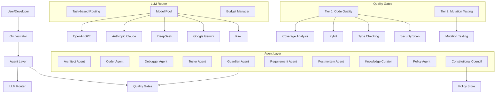
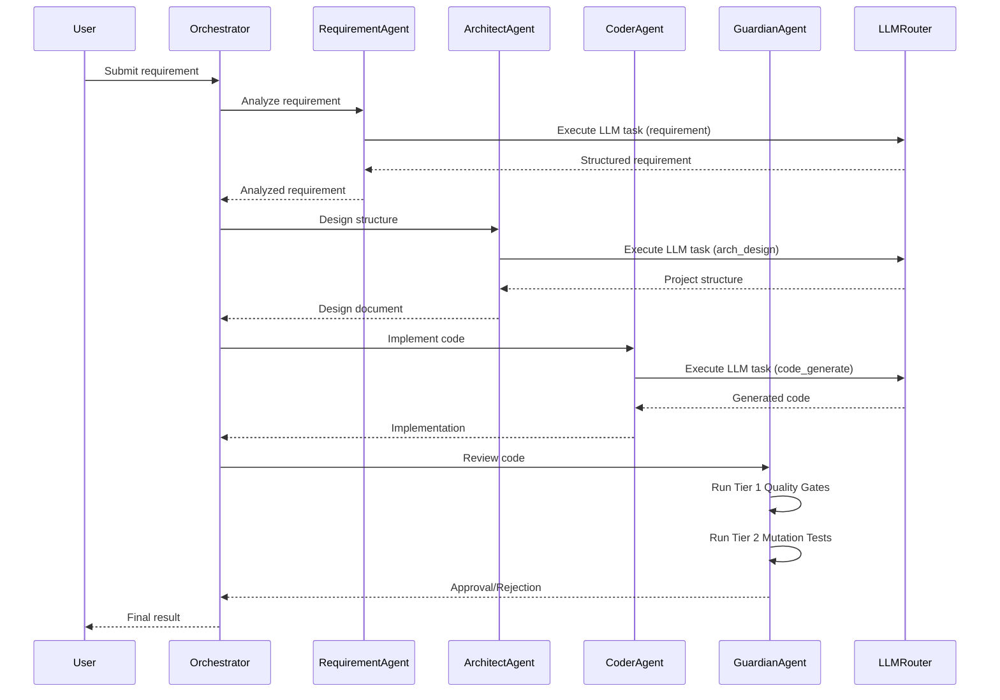
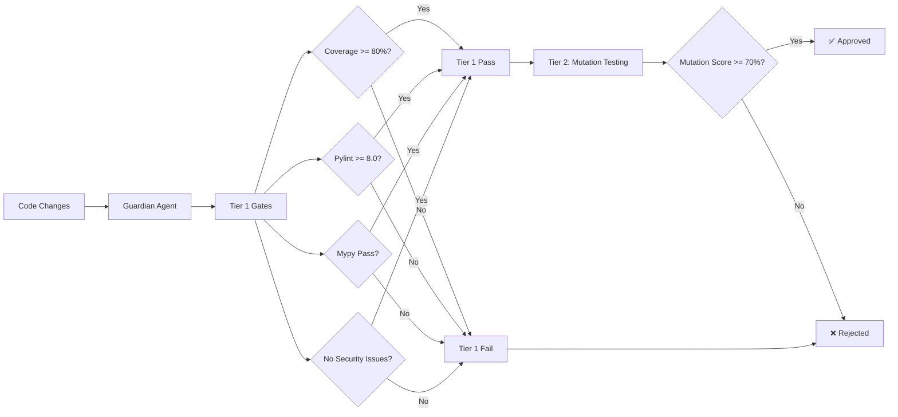

# NexusCore Architecture

> **SSOT (Single Source of Truth) 入口**: このドキュメントは NexusCore のアーキテクチャの SSOT です。開発タスク開始前に必ず参照してください。

## Gate（参照強制）

開発タスク開始前に必ず参照する：
- このドキュメント（`docs/ARCHITECTURE.md`）
- [Project Profile](../PROJECT_PROFILES/PROJECT_PROFILE_NEXUSCORE.md)
- [Governance](../GOVERNANCE/README.md)
- 変更対象に関連する Spec（`docs/spec/` または `GOVERNANCE/spec/`）

## System Overview

NexusCore is a multi-agent AI development framework with integrated quality gates, LLM routing, and constitutional governance.

## High-Level Architecture



## Component Details

### 1. Agent Layer

#### Core Agents

**ArchitectAgent** (`src/nexuscore/agents/architect_agent.py`)
- Designs project structure
- Creates architectural plans
- Technology stack recommendations

**CoderAgent** (`src/nexuscore/agents/coder_agent.py`)
- Implements code based on requirements
- Syntax validation
- Self-healing code generation

**DebuggerAgent** (`src/nexuscore/agents/debugger_agent.py`)
- Analyzes error logs
- Generates fixes
- Creates unified diffs
- Knowledge base integration

**TesterAgent** (`src/nexuscore/agents/tester_agent.py`)
- Generates test cases
- Context-aware testing
- Integration with test strategy

**GuardianAgent** (`src/nexuscore/agents/guardian_agent.py`)
- Multi-tier quality gates
- Code review automation
- Approval/rejection workflow
- Git integration

#### Support Agents

**RequirementAgent** (`src/nexuscore/agents/requirement_agent.py`)
- Requirement elicitation
- Specification analysis
- Clarity checking

**PostmortemAgent** (`src/nexuscore/agents/postmortem_agent.py`)
- Failure analysis
- Root cause identification
- Recommendation generation

**KnowledgeCuratorAgent** (`src/nexuscore/agents/knowledge_curator_agent.py`)
- Knowledge base management
- Experience capture
- Pattern extraction

**PolicyAgent** (`src/nexuscore/agents/policy_agent.py`)
- Policy enforcement
- Compliance checking
- Rule validation

**ConstitutionalCouncilAgent** (`src/nexuscore/agents/constitutional_council_agent.py`)
- Policy amendment management
- Constitutional governance
- Amendment approval workflow

### 2. LLM Router

**Task-Based Routing** (`src/nexuscore/llm/llm_router.py`)

Routes tasks to optimal LLM based on:
- Task type (code_generate, code_review, debug, etc.)
- Cost constraints
- Model capabilities
- Fallback strategies

**Supported Task Types:**
```python
{
    'code_generate': 'openai:gpt-5.1-codex',
    'code_review': 'anthropic:claude-4.5-sonnet',
    'debug': 'openai:gpt-5.1-codex',
    'test_generate': 'openai:gpt-5.1-codex',
    'architect': 'openai:gpt-5.1',
    'policy_check': 'anthropic:claude-4.5-sonnet',
    'postmortem_analyze': 'openai:gpt-5.1',
    'knowledge_curate': 'google:gemini-3.0-pro',
    # ... and more
}
```

**Budget Management:**
- Daily spending limits
- Cost tracking per task
- Automatic model downgrading

### 3. Quality Gates

#### Tier 1: Code Quality

**Coverage Analysis** (`src/nexuscore/utils/code_analyzer.py`)
- Line coverage measurement
- Branch coverage
- Threshold enforcement (default: 80%)

**Static Analysis:**
- **Pylint**: Code quality score (threshold: 8.0/10)
- **Mypy**: Type checking
- **Bandit**: Security vulnerability detection

**Output:** `QualityReport` dataclass
```python
@dataclass
class QualityReport:
    passed: bool
    coverage_percentage: float
    coverage_passed: bool
    pylint_score: float
    pylint_passed: bool
    mypy_passed: bool
    mypy_output: str
    bandit_passed: bool
    security_issues: List[SecurityIssue]
    feedback: str
    violations: List[str]
```

#### Tier 2: Mutation Testing

**MutationTesterAgent** (`src/nexuscore/agents/mutation_tester_agent.py`)
- Generates code mutants
- Runs test suite against mutations
- Calculates mutation score
- Identifies weak tests

**Output:** `MutationReport` dataclass
```python
@dataclass
class MutationReport:
    passed: bool
    mutation_score: float
    total_mutants: int
    killed: int
    survived: int
    timeout: int
    suspicious: int
    survived_mutants: List[Mutant]
```

### 4. Policy & Governance

**PolicyInterface** (`src/nexuscore/agents/policy_interface.py`)
- User-facing policy configuration
- Gradio UI integration
- Safe defaults

**ConstitutionalCouncilAgent**
- Amendment proposal system
- Policy validation
- Approval workflow
- Audit trail

### 5. Context & Analysis

**ContextAgent** (`src/nexuscore/agents/context_agent.py`)
- Project context gathering
- Framework detection
- Error prevention rules

**ContextAnalyzer** (`src/nexuscore/agents/context_analyzer.py`)
- Tech stack detection
- Dependency analysis
- Environment detection
- File structure scanning

## Data Flow

### Typical Development Workflow



### Guardian Review Flow



## File Structure

```
src/nexuscore/
├── agents/                    # AI Agent implementations
│   ├── base_agent.py          # Base agent class with LLM integration
│   ├── architect_agent.py     # Architecture design
│   ├── coder_agent.py         # Code generation
│   ├── debugger_agent.py      # Error fixing
│   ├── tester_agent.py        # Test generation
│   ├── guardian_agent.py      # Quality gates
│   ├── requirement_agent.py   # Requirement analysis
│   ├── postmortem_agent.py    # Failure analysis
│   ├── knowledge_curator_agent.py  # Knowledge management
│   ├── policy_agent.py        # Policy enforcement
│   ├── constitutional_council_agent.py  # Governance
│   └── mutation_tester_agent.py  # Mutation testing
│
├── llm/                       # LLM integration layer
│   ├── llm_router.py          # Task-based model routing
│   ├── budget_manager.py      # Cost tracking
│   └── providers/             # LLM provider implementations
│
├── utils/                     # Utility modules
│   ├── code_analyzer.py       # Code quality analysis
│   ├── vcs.py                 # Git operations
│   ├── diff_tools.py          # Diff generation
│   └── test_generator.py     # Test generation utilities
│
└── webapp/                    # Web interface
    ├── orchestrator.py        # Main orchestration logic
    ├── api_*.py               # API endpoints
    └── views_*.py             # Web views
```

## Key Design Patterns

### 1. Agent Pattern
- Each agent inherits from `BaseAgent`
- Standardized LLM interaction via `execute_llm_task()`
- Task-specific prompts via `system_prompt`

### 2. Quality Gate Pattern
- Multi-tier validation (Tier 1: Static, Tier 2: Dynamic)
- Fail-fast on critical issues
- Detailed feedback for failures

### 3. Constitutional AI Pattern
- Policy-driven decision making
- Amendment proposal system
- Audit trail for governance

### 4. Router Pattern
- Task-based model selection
- Cost optimization
- Automatic fallback

### 5. Knowledge Base Pattern
- Experience capture from failures
- Pattern matching for solutions
- Global/local knowledge bases

## Technology Stack

**Languages:**
- Python 3.11+

**AI/LLM:**
- OpenAI GPT (GPT-5.1, GPT-5.1-Codex, GPT-5.1-Mini)
- Anthropic Claude (Claude 4.5 Sonnet)
- DeepSeek (DeepSeek R1)
- Google Gemini (Gemini 3.0 Pro)
- Kimi

**Testing:**
- pytest
- pytest-cov
- mutation testing (custom)

**Code Quality:**
- pylint
- mypy
- bandit

**Version Control:**
- GitPython

**Web Framework:**
- Flask (webapp)
- Gradio (policy interface)

**Other:**
- patch-ng (unified diff parsing)
- dataclasses (structured data)

## Scalability & Performance

**Current State:**
- Synchronous agent execution
- Single-process architecture
- In-memory state management

**Future Considerations:**
- Parallel agent execution
- Distributed task queue (Celery ready)
- Persistent state storage
- Horizontal scaling via API layer

## Security

**Current Measures:**
- Bandit security scanning
- API key management
- Budget limits
- Policy enforcement

**Sandboxing:**
- Code execution in isolated environment
- File system access controls
- Network restrictions

## Monitoring & Observability

**Logging:**
- Structured logging via Python logging
- Agent-level tracing
- LLM call tracking

**Metrics:**
- Budget tracking per task
- Quality gate pass/fail rates
- Agent execution times
- LLM token usage

## Extension Points

1. **New Agents**: Inherit from `BaseAgent`, implement task-specific logic
2. **New LLM Providers**: Implement provider interface in `llm/providers/`
3. **Custom Quality Gates**: Extend `GuardianAgent` with new validators
4. **Policy Rules**: Add to `ConstitutionalCouncilAgent` policy store
5. **Knowledge Patterns**: Extend knowledge base with custom matchers
