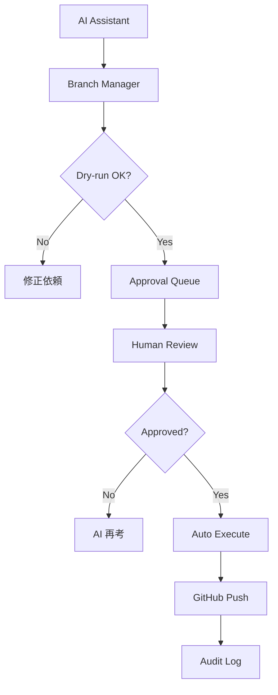

# Phase 3: 人間承認付き完全自動化計画

## 概要

このドキュメントは、GitHub STITワークフローの完全自動化に向けた
**人間承認プロセス付き実装計画**を定義する。

完全自動化はリスクが高いため、段階的な実装と厳格な安全対策を講じる。

---

## 1. 目標

AIが自らブランチ作成・プッシュを判断・実行するが、
**人間の承認プロセスを必ず経由**することで安全性を確保する。

```
[AI タスク開始]
    ↓
[自動: ブランチ名生成・検証]
    ↓
[AI: 承認依頼提出]
    ↓
[人間: 承認/却下]
    ↓
[承認時: 自動実行]
[却下時: AI 再考]
```

---

## 2. 必要要件

### 2-1. 承認フロー要件

| 要件 | 説明 |
|------|------|
| 承認者 | 人間（AI は承認できない） |
| 承認手段 | GitHub PR、CLI承認コマンド、専用ダッシュボード |
| 承認期限 | 設定可能（24時間、48時間など） |
| 自動却有 | 期限切れの場合、自動的に却下 |

### 2-2. 安全性要件

| 要件 | 説明 |
|------|------|
| ブランチ保護 | main ブランチへの直接プッシュ禁止 |
| Dry-run 必須 | 実際の操作前に実行計画を表示 |
| 操作ログ | 全操作の監査ログ記録 |
| 権限分離 | 読み取り専用モードの提供 |

### 2-3. 機能要件

| 要件 | 説明 |
|------|------|
| 自動命名 | タスクID・説明からブランチ名を自動生成 |
| 命名検証 | 命名規則への準拠を自動チェック |
| Issue連携 | 適切な Issue への自動リンク |
| ステータス追跡 | 承認状況のリアルタイム追跡 |

---

## 3. アーキテクチャ

### 3-1. コンポーネント構成

```
+------------------+
|  AI Assistant    |
+--------+---------+
         |
         v
+--------+---------+
|  Branch Manager  |
|  (自動生成・検証) |
+--------+---------+
         |
         v
+--------+---------+
|  Approval Queue |
|  (承認待ち行列)   |
+--------+---------+
         |
    +----+----+
    |         |
    v         v
+-----+   +-----+
|Human|   |Human|
|Approval| |Reject|
+-----+   +-----+
    |         |
    v         v
+--------+   +--------+
|Auto    |   |Notify  |
|Execute |   |AI Retry|
+--------+   +--------+
```

### 3-2. データフロー



---

## 4. 実装計画

### 4-1. Phase 3-1: 承認キューシステム

**Goal**: 承認待ち行列の基本機能を実装

| タスク | 説明 |
|-------|------|
| 承認リクエスト作成 | AI から承認リクエストを生成 |
| キュー管理 | リクエストの状態管理 |
| 承認UI | 人間用の承認インターフェース |
| 通知機能 | 承認依頼の通知 |

### 4-2. Phase 3-2: GitHub 統合

**Goal**: GitHub 機能との連携を実装

| タスク | 説明 |
|-------|------|
| GitHub Actions | 承認ワークフローの自動化 |
| Issue 連携 | Issue ベースの承認管理 |
| PR 統合 | PR での承認プロセス |
| ブランチ保護 | 保護ルールの自動設定 |

### 4-3. Phase 3-3: 安全対策強化

**Goal**: リスク分析に基づく安全対策を実装

| リスク対策 | 実装内容 |
|-----------|----------|
| 誤操作防止 | Dry-run 必須化、二重確認 |
| 権限管理 | 役割ベースのアクセス制御 |
| 監査ログ | 全操作の記録と監視 |
| 緊急停止 | 即座に停止できる仕組み |

### 4-4. Phase 3-4: AI 統合

**Goal**: Cursor AI との統合を実装

| タスク | 説明 |
|-------|------|
| Cursor Rule | 自動化ガイドラインの追加 |
| 承認プロンプト | AI 用の承認依頼テンプレート |
| 再試行処理 | 却下時の再考プロセス |
| 学習機能 | 承認パターンの分析 |

---

## 5. セキュリティ

### 5-1. 認証・認可

| 項目 | 対策 |
|------|------|
| GitHub Token | 最小権限の Token を使用 |
| API キー | 暗号化して保存 |
| 人間確認 | 二要素認証との連携 |

### 5-2. 操作制限

| 操作 | 制限 |
|------|------|
| ブランチ作成 | 命名規則必須検証 |
| ブランチ削除 | 保護されたブランチは禁止 |
| ブランチ名変更 | 既存ブランチは禁止 |
| マージ | PR必須、レビュー必須 |

---

## 6. 監視・ログ

### 6-1. 監査ログ

| ログ項目 | 説明 |
|----------|------|
| 操作日時 | いつ実行されたか |
| 操作者 | 人間か AI か |
| 操作内容 | 具体的な操作内容 |
| 承認者 | 承認した人間 |
| 結果 | 成功か失敗か |

### 6-2. 監視項目

| 項目 | 監視方法 |
|------|----------|
| 承認率 | 承認/却下の割合 |
| 処理時間 | 承認までの平均時間 |
| エラー率 | 失敗の発生率 |
| セキュリティ | 不正アクセスの検出 |

---

## 7. 段階的デプロイ

### 7-1. デプロイ順序

| フェーズ | 内容 | リスク |
|----------|------|--------|
| Phase 3-1 | 承認キュー（読み取り専用） | 低 |
| Phase 3-2 | GitHub 統合（dry-run） | 低 |
| Phase 3-3 | 安全対策強化 | 中 |
| Phase 3-4 | AI 統合（監視付き） | 中 |
| Phase 3-5 | 完全自動化（承認必須） | 高 |

### 7-2. ロールバック計画

| 情形 | 対応 |
|------|------|
| エラー発生 | 前バージョンに切り戻し |
| セキュリティ問題 | 即座に無効化 |
| パフォーマンス問題 | 負荷分散の調整 |

---

## 8. 成功指標

### 8-1. 定量的指標

| 指標 | 目標値 |
|------|--------|
| 承認率 | 80%以上 |
| 処理時間 | 4時間以内 |
| エラー率 | 1%以下 |
| 自動化率 | 50%以上 |

### 8-2. 定性的指標

| 指標 | 評価方法 |
|------|----------|
| 開発者満足度 | アンケート調査 |
| 安全性の認識 | セキュリティレビュー |
| 効率化の効果 | 開発速度の比較 |

---

## 9. リスク管理

### 9-1. 残存リスク

| リスク | 発生確率 | 影響 | 対策 |
|--------|----------|------|------|
| 承認疲れ | 中 | 低 | 承認の簡素化 |
| 自動化の誤り | 低 | 高 | 二重確認 |
| 権限の濫用 | 低 | 高 | 権限の最小化 |

### 9-2. 緩和策

| リスク | 緩和策 |
|--------|--------|
| 誤った承認 | 操作前の詳細な確認 |
| 権限外操作 | 権限チェックの厳格化 |
| ログ改ざん | ログの暗号署名 |

---

## 10. スケジュール

| フェーズ | 期間 | マイルストーン |
|----------|------|----------------|
| Phase 3-1 | 2週間 | 承認キュー完成 |
| Phase 3-2 | 2週間 | GitHub統合完了 |
| Phase 3-3 | 1週間 | 安全対策完成 |
| Phase 3-4 | 2週間 | AI統合完了 |
| Phase 3-5 | 2週間 | 完全自動化稼働 |

---

## 11. 参考文献

- [リスク分析結果](../docs/github_stit_workflow_automization_risks.md)
- [Phase 1: CLIスクリプト](../tools/stit_branch.py)
- [Phase 2: Cursorルール](../.cursor/rules/nexuscore-stit-compliance.mdc)
- [GitHub STITワークフロー](../docs/integrations/GITHUB_STIT_WORKFLOW.md)

---

*作成日: 2026-02-04*
*バージョン: 1.0*
