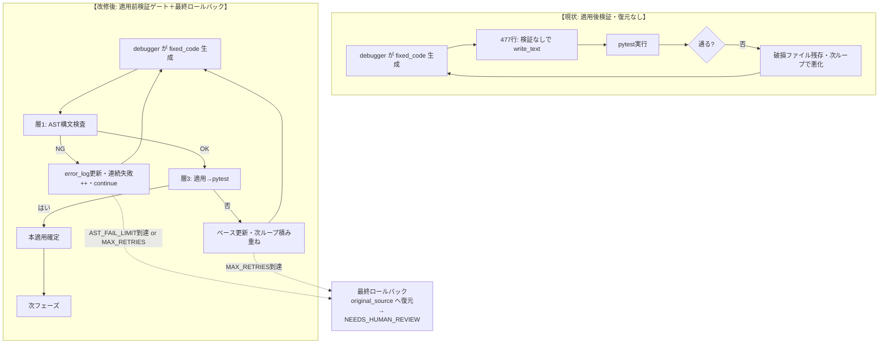

# NexusCore DebuggerAgent patch 破損根本防止 — 設計 spec

- **日付**: 2026-07-24
- **対象**: NexusCore v8.2.0 / `src/nexuscore/core/phase_runner_mixin.py` 他
- **関連**: [[2026-07-23_問題③要件再定義-coder-fail-safe化]] / [[2026-07-24_task-model-map-Gemini節約再設計実装]] / バックログ「CoderAgent 説明文出力の根源改善」「自己修復パッチ適用の安定化」

## 1. 背景と目的

### 1.1 問題
NexusCore の testing フェーズには自己修復デバッグループがある。A検証（dynamic完走・2026-07-24）で、**DebuggerAgent 経由で LLM(GLM) が説明文を返し、それが `fixed_code` として実装ファイル(primes.py 等)に保存され破損** することが再発した。

CoderAgent（別経路）は既に fail-safe 済（`b801a0d9`・RETRY枯渇で空文字返却）だが、DebuggerAgent 経路は未対応。A検証で「全コード生成系 Agent に同一 fail-safe が必要」と範囲確定済。

### 1.2 ユーザーの根本指摘（設計の出発点）
> 「AST検査+RETRY は第一防線（層1）としてあってはいいが、根本対策ではない。意味の正しさ（正しい修正か）は構文検査では判定できない。」

→ AST検査は SyntaxError しか弾けず、「文法的に正しいが間違った修正」「たまたま構文OKの説明文」はすり抜ける。primes.py が助かったのは説明文が SyntaxError を起こしたから（運）。根本対策には「意味の正しさを検証する仕組み」が必要。

### 1.3 目的（成功基準）
**DebuggerAgent 経由のファイル破損を根本防止する**。特に：
- 説明文/破損 patch の適用を阻止（層1）
- **生成コードの意味の正しさを、実行検証(pytest)で担保**（層3・核心）
- 破損ファイルが次ループに持ち越される悪化ループを根絶（最終ロールバック）
- 破損確定時は安全に失敗し NEEDS_HUMAN_REVIEW へ（悪化ループ防止）

## 2. 現状の問題（コード構造）

### 2.1 破損メカニズム（`phase_runner_mixin.py:452-485`）

```python
while (not passed and primary_impl_path and debugger_agent
       and debug_retries < DEBUG_MAX_RETRIES):   # DEBUG_MAX_RETRIES=3（env: NEXUS_DEBUG_MAX_RETRIES）
    debug_retries += 1
    source = impl_files[primary_impl_path]
    debug_result = self.debugger_agent.debug_and_patch(error_log, {primary_impl_path: source}, ...)
    fixed_code = (debug_result or {}).get("fixed_code")
    if not fixed_code:
        break
    impl_abs_path.write_text(str(fixed_code))    # ★477行: 適用前検証なし
    result = run_in_sandbox([pytest])
    passed = result.returncode == 0              # 失敗しても復元せず次ループ→悪化
```

**核心の脆弱性**: 層3（実行検証=pytest）は既存だが、**「失敗時の復元」がない**。説明文入り fixed_code が477行で書き込まれ、pytest 失敗後も破損ファイルが残り、次ループがそれを修正対象にして悪化。

### 2.2 判明した3つの事実（context 探求より）
1. 層3（pytest実行検証）は既存・testingフェーズで回っている
2. DebuggerAgent の patch に「適用前検証ゲート」がない
3. review フェーズ（code_review=Gemini）は事後・自己修復ループに入らない（既存の複数LLM連携が火種のループに未活用）

### 2.3 自己修復パッチ適用の別系統（本件と無関係・確認済）
`self_healing_service.py` / `patch_applier.py` は **patch 適用のみ**（コード生成しない）。コード生成系は CoderAgent と DebuggerAgent の2つのみ。よって本件の対象は DebuggerAgent 経路（phase_runner のループ）に確定。

## 3. 設計方針（sentaku L1/L1.5 + multi-llm-review 統合）

### 3.1 D案採用：実行検証中心・LLM検証は補助
sentaku で A(最小)/B(ループ健全化)/C(アーキ分離) を比較 → **D案（Bの堅牢化版）** に収束。
- **検証の主軸を pytest（実行検証）に置く**（LLMの機嫌・RPD25/時間帯制約に左右されない）
- LLM検証（別LLMで品質補完）は「補助オプション」に降格

### 3.2 D-1段階導入（LLM検証は後回し・YAGNI）
- **第1段（本spec）**: 層1(AST検査)＋層3(実行検証)＋最終ロールバック
- **第2段（別タスク）**: LLM検証オプション・散文ヒューリスティック・AST差分検証

理由: 層1+層3 だけで破損防止は完全達成。実API依存を入れず堅牢版を先にリリースし、運用実績を積んでから第2段。

### 3.3 層構造（根本対策の全体像・本specは層1+層3）
| 層 | 役割 | 本spec |
|---|---|---|
| 層1 | AST構文検査（説明文を早期弾く） | ✅ 実装 |
| 層2 | プロンプト強化+抽出の堅牢化 | 別（6d3fセッション・CoderAgent根治療） |
| 層3 | **実行検証(pytest)＋失敗時復元** | ✅ 実装（核心） |
| 層4 | 複数LLM連携（別LLM品質補完） | 第2段（後回し） |

## 4. アーキテクチャ（before/after）



## 5. コンポーネント

### 5.1 変更対象（Surgical・1ファイル＋新規utils 1つ）

| ファイル | 変更 | 役割 |
|---|---|---|
| `src/nexuscore/core/phase_runner_mixin.py` | 改修 | デバッグループ（452-485行）に層1+層3+最終ロールバックを実装 |
| `src/nexuscore/utils/syntax_validator.py` | **新設** | `validate_python_syntax(code) -> tuple[bool,str]`（ast.parseラッパー・10行・phase_runner が使用） |

**※ coder_agent.py の utils 移行はスコープ外**: `coder_agent.py` は現在 6d3f セッション（CoderAgent 根治療・🟢進行中）が占有中。並行セッション競合回避のため、本specでは `utils/syntax_validator.py` を新設し **phase_runner 側のみ使用**。CoderAgent の `_validate_python_syntax` との重複は許容（sentaku 案Aと整合）。6d3f 完了後に別タスクで CoderAgent を utils へ移行し重複を解消する。multi-llm-review #5「共通化」は、本specが utils の土台を作ることで半分達成（後続移行の基盤）。

### 5.2 定数
- `DEBUG_MAX_RETRIES = _env_int("NEXUS_DEBUG_MAX_RETRIES", 3)`（既存・変更なし）
- **`AST_FAIL_LIMIT = _env_int("NEXUS_AST_FAIL_LIMIT", 2)`**（新設・2回連続AST NGで早期脱出）

## 6. データフロー（改修後ループ・確定版）

```python
# ループ前退避
original_source = impl_files[primary_impl_path]      # 最終ロールバック用
current_source = original_source                      # インクリメンタル修正のベース
ast_fail_streak = 0
debug_history: list[dict] = []                        # NEEDS_HUMAN_REVIEW診断用
error_log = result.stdout + "\n" + result.stderr      # 初回（前段テスト失敗ログ）

while (not passed and primary_impl_path and debugger_agent
       and debug_retries < DEBUG_MAX_RETRIES):
    debug_retries += 1
    debug_result = self.debugger_agent.debug_and_patch(
        error_log, {primary_impl_path: current_source}, self.project_path)
    # #6 型安全（multi-llm-review採用）
    if not isinstance(debug_result, dict):
        debug_result = {}
    fixed_code = debug_result.get("fixed_code")
    if not fixed_code:
        debug_history.append({"attempt": debug_retries, "result": "no_fixed_code"})
        break

    # 層1: AST検査（utils/syntax_validator・共通化）
    ok, err = validate_python_syntax(fixed_code)
    if not ok:
        ast_fail_streak += 1                           # #3 連続失敗カウンタ
        error_log = f"SyntaxError: 生成コードが不正({err})。コードのみ出力せよ"  # #2 フィードバック
        debug_history.append({"attempt": debug_retries, "ast": "NG", "err": err})
        if ast_fail_streak >= AST_FAIL_LIMIT:
            break                                      # 早期脱出（説明文しか返さない故障）
        continue                                      # current_source 維持・ベース変わらず

    ast_fail_streak = 0
    # 層3: 適用（都度復元しない・積み重げ修正・#1）
    impl_abs_path.write_text(str(fixed_code))
    current_source = str(fixed_code)                   # 次ループのベース更新
    impl_files[primary_impl_path] = current_source
    result = run_in_sandbox(["python", "-m", "pytest", str(test_abs_path), "-q"],
                            cwd=self.project_path)
    passed = result.returncode == 0
    debug_history.append({"attempt": debug_retries, "ast": "OK", "passed": passed})
    if not passed:
        error_log = result.stdout + "\n" + result.stderr

# 最終ロールバック（#1・脱出後 not passed の時のみ・破損残存防止）
if not passed:
    impl_abs_path.write_text(original_source)
    impl_files[primary_impl_path] = original_source

context.debug_retries = debug_retries
context.debug_history = debug_history                  # #7 review フェーズへ伝播
context.testing = {"tests": test_code, "test_path": str(test_abs_path),
                   "passed": passed, "stdout": result.stdout, "stderr": result.stderr}
return context
```

### 6.1 review フェーズへの伝播（#7・既存改修）
`run_review_phase` で NEEDS_HUMAN_REVIEW 到達時、`context.debug_history` を review_report に添付（各試行の AST判定/通過/エラー要約）。人間診断コスト低下。

## 7. エラー処理とループ脱出

| 状況 | 処理 |
|---|---|
| `fixed_code` 空 | `break`（既存）・履歴記録 |
| AST NG（連続 < AST_FAIL_LIMIT） | `error_log` フィードバック更新・`continue`（ベース維持） |
| AST NG（連続 >= AST_FAIL_LIMIT=2） | `break`（早期脱出・LLMが説明文しか返さない故障検知） |
| AST OK・pytest 失敗 | ベース更新・次ループ（積み重ね修正） |
| AST OK・pytest 通過 | 本適用確定・`passed=True`・ループ終了 |
| `debug_retries >= DEBUG_MAX_RETRIES(3)` | `break`（既存） |
| ループ脱出後 `not passed` | **最終ロールバック**（original_source へ復元）→ review フェーズで NEEDS_HUMAN_REVIEW |

### 7.1 副産物汚染についての注記（multi-llm-review #4）
`run_in_sandbox` は `cwd=self.project_path` 共有・プロセス分離のみ。pytest が `__pycache__/`・`.pytest_cache/` を生成するが、pytest はソース変更を mtime 検知で再コンパイルするため、実害は限定的。本specでは注記のみ（副産物クリーンアップは過剰・YAGNI）。

## 8. テスト方針

### 8.1 TDD（RED→GREEN）
新規utils とループ改修をテスト駆動。CI-safe（実API・実pytestはモック）。

### 8.2 想定テスト群
1. **`utils/syntax_validator` 単体**: 有効Python/無効Python/空文字の3ケース
2. **ループ改修・破損防止**:
   - LLMが説明文（SyntaxError）→ AST NG で continue・ファイル不変
   - AST NG 連続2回 → 早期脱出・original_source 維持
   - LLMが正しい修正 → pytest 通過・本適用
   - LLMが構文OKだが意味NG修正 → pytest 失敗・ベース更新・最終的に original へロールバック
3. **最終ロールバック**: 全リトライ失敗後・ファイルが original_source に戻る
4. **debug_history 蓄積**: 各試行の記録が正しく残る
5. **utils/syntax_validator 単体**: phase_runner からの呼出経路（coder_agent.py は触らないため CoderAgent 回帰テストは不要・6d3f完了後の移行タスクで実施）

### 8.3 モック方針
- `debugger_agent.debug_and_patch` → 固定 `fixed_code` を返すモック
- `run_in_sandbox` → `returncode` と stdout/stderr を制御するモック
- 実API・実pytest は使わない（CI-safe）

## 9. multi-llm-review 経緯（2026-07-24 04:59・Gemini+MiniMax）

### 9.1 直交性実証
両LLMが独立に「都度復元がインクリメンタルデバッグを破壊する」を指摘（Gemini critical / MiniMax high 同根）。これが本specの最終ロールバック方式採用の決定打。

### 9.2 採用7点（すべて本specに反映）
1. 都度復元→最終ロールバック（Gemini critical）
2. AST NG時の error_log フィードバック更新（Gemini high + MiniMax high）
3. AST連続失敗カウンタ（MiniMax high）
4. pytest副産物汚染の注記（MiniMax med）
5. AST検査共通 utils 化（MiniMax med）
6. debug_result 型安全（Gemini low）
7. デバッグ失敗履歴の NEEDS_HUMAN_REVIEW 添付（MiniMax low）

### 9.3 却下2点
- 散文ヒューリスティック+AST差分検証を層2に（MiniMax med）→ 第2段候補
- PR分割（MiniMax low）→ 個人開発main直運用のためコミット分割に読替

## 10. スコープ外・次段

### 10.1 本specのスコープ外
- **層2（プロンプト/抽出の堅牢化）**: CoderAgent 根治療は 6d3f セッションが🟢進行中（別経路・並行）
- **層4（複数LLM連携による品質補完）**: 第2段・実API依存を入れる前に運用実績を積む

### 10.2 次段（別タスク）
- LLM検証オプション（pytest通過後・Gemini/MiniMaxで品質補完・非ブロック）
- 散文ヒューリスティック（「以下は〜」「This function」等の説明文マーカー検出）
- AST差分検証（元コードと fixed_code の構造変化のみ許容）

### 10.3 完了条件（本spec）
- [ ] `utils/syntax_validator.py` 新設（phase_runner 用）
- [ ] `phase_runner_mixin.py` デバッグループ改修（層1+層3+最終ロールバック+AST_FAIL_LIMIT）
- [ ] `context.debug_history` 伝播・review_report 添付
- [ ] TDD テスト群（8.2）追加・全既存テスト通過
