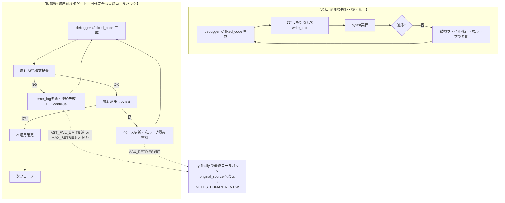

# NexusCore DebuggerAgent patch 破損根本防止 — 設計 spec

- **日付**: 2026-07-24（2巡目 multi-llm-review 改訂済）
- **対象**: NexusCore v8.2.0 / `src/nexuscore/core/phase_runner_mixin.py` 他
- **関連**: [[2026-07-23_問題③要件再定義-coder-fail-safe化]] / [[2026-07-24_task-model-map-Gemini節約再設計実装]] / バックログ「CoderAgent 説明文出力の根源改善」「自己修復パッチ適用の安定化」

## 1. 背景と目的

### 1.1 問題
NexusCore の testing フェーズには自己修復デバッグループがある。A検証（dynamic完走・2026-07-24）で、**DebuggerAgent 経由で LLM(GLM) が説明文を返し、それが `fixed_code` として実装ファイル(primes.py 等)に保存され破損** することが再発した。

CoderAgent（別経路）は既に fail-safe 済（`b801a0d9`・RETRY枯渇で空文字返却）だが、DebuggerAgent 経路は未対応。A検証で「全コード生成系 Agent に同一 fail-safe が必要」と範囲確定済。

### 1.2 ユーザーの根本指摘（設計の出発点）
> 「AST検査+RETRY は第一防線（層1）としてあってはいいが、根本対策ではない。意味の正しさ（正しい修正か）は構文検査では判定できない。」

→ AST検査は SyntaxError しか弾けず、「文法的に正しいが間違った修正」「たまたま構文OKの説明文」はすり抜ける。根本対策には「意味の正しさを検証する仕組み（実行検証）」が必要。

### 1.3 目的（成功基準）
**DebuggerAgent 経由のファイル破損を根本防止する**。特に：
- 説明文/破損 patch の適用を阻止（層1）
- **生成コードの意味の正しさを、実行検証(pytest)で担保**（層3・核心）
- 破損ファイルが次ループに持ち越される悪化ループを根絶（最終ロールバック）
- 破損確定時は安全に失敗し NEEDS_HUMAN_REVIEW へ（悪化ループ防止）

## 2. 現状の問題（コード構造）

### 2.1 破損メカニズム（`phase_runner_mixin.py::run_testing_phase` デバッグループ）

```python
while (not passed and primary_impl_path and debugger_agent
       and debug_retries < DEBUG_MAX_RETRIES):   # DEBUG_MAX_RETRIES=3（env: NEXUS_DEBUG_MAX_RETRIES）
    debug_retries += 1
    source = impl_files[primary_impl_path]
    debug_result = self.debugger_agent.debug_and_patch(error_log, {primary_impl_path: source}, ...)
    fixed_code = (debug_result or {}).get("fixed_code")
    if not fixed_code:
        break
    impl_abs_path.write_text(str(fixed_code))    # ★477行: 適用前検証なし
    result = run_in_sandbox([pytest])
    passed = result.returncode == 0              # 失敗しても復元せず次ループ→悪化
```

**核心の脆弱性**: 層3（実行検証=pytest）は既存だが、**「失敗時の復元」がない**。説明文入り fixed_code が書き込まれ、pytest 失敗後も破損ファイルが残り、次ループがそれを修正対象にして悪化。

### 2.2 判明した3つの事実（context 探求より）
1. 層3（pytest実行検証）は既存・testingフェーズで回っている
2. DebuggerAgent の patch に「適用前検証ゲート」がない
3. review フェーズ（code_review=Gemini）は事後・自己修復ループに入らない（既存の複数LLM連携が火種のループに未活用）

### 2.3 自己修復パッチ適用の別系統（本件と無関係・確認済）
`self_healing_service.py` / `patch_applier.py` は **patch 適用のみ**（コード生成しない）。コード生成系は CoderAgent と DebuggerAgent の2つのみ。よって本件の対象は DebuggerAgent 経路（phase_runner のループ）に確定。

## 3. 設計方針（sentaku L1/L1.5 + multi-llm-review 2巡統合）

### 3.1 D案採用：実行検証中心・LLM検証は補助
sentaku で A(最小)/B(ループ健全化)/C(アーキ分離) を比較 → **D案（Bの堅牢化版）** に収束。
- **検証の主軸を pytest（実行検証）に置く**（LLMの機嫌・RPD25/時間帯制約に左右されない）
- LLM検証（別LLMで品質補完）は「補助オプション」に降格

### 3.2 D-1段階導入（LLM検証は後回し・YAGNI）
- **第1段（本spec）**: 層1(AST検査)＋層3(実行検証)＋最終ロールバック
- **第2段（別タスク・§10.2）**: LLM検証オプション・散文ヒューリスティック・AST差分検証

理由: 層1+層3 だけで破損防止は完全達成。実API依存を入れず堅牢版を先にリリース。

### 3.3 層構造（根本対策の全体像・本specは層1+層3）
| 層 | 役割 | 本spec |
|---|---|---|
| 層1 | AST構文検査（説明文を早期弾く） | ✅ 実装 |
| 層2 | プロンプト強化+抽出の堅牢化 | 別（6d3fセッション・CoderAgent根治療） |
| 層3 | **実行検証(pytest)＋失敗時復元** | ✅ 実装（核心） |
| 層4 | 複数LLM連携（別LLM品質補完） | 第2段（後回し） |

## 4. アーキテクチャ（before/after）



## 5. コンポーネント

### 5.1 変更対象（Surgical・メソッド名で指示・6d3f非干渉）

| ファイル | 変更 | 役割 |
|---|---|---|
| `src/nexuscore/core/phase_runner_mixin.py` | 改修 | `run_testing_phase` のデバッグループに層1+層3+try-finally最終ロールバックを実装 |
| `src/nexuscore/utils/syntax_validator.py` | **新設** | `validate_python_syntax(code) -> tuple[bool,str]`（ast.parseラッパー・phase_runner が使用） |

**※ coder_agent.py の utils 移行はスコープ外**: `coder_agent.py` は現在 6d3f セッション（CoderAgent 根治療・🟢進行中）が占有中。並行セッション競合回避のため、本specでは `utils/syntax_validator.py` を新設し **phase_runner 側のみ使用**。CoderAgent の `_validate_python_syntax` との重複は許容（sentaku 案Aと整合）。6d3f 完了後に別タスクで CoderAgent を utils へ移行し重複を解消する。

**※ 単一ファイル前提**: `debug_and_patch` は現状「単一ファイル処理を前提」（debugger_agent.py:82）。本specのロールバックも primary_impl_path 単位。将来 DebuggerAgent が複数ファイル修正に拡張される場合は、original_impl_files 全体退避に改める（YAGNI・現状は単一）。

### 5.2 定数
- `DEBUG_MAX_RETRIES = _env_int("NEXUS_DEBUG_MAX_RETRIES", 3)`（既存・変更なし）
- **`AST_FAIL_LIMIT = _env_int("NEXUS_AST_FAIL_LIMIT", 2)`**（新設・**連続**2回AST NGで早期脱出）
  - 根拠: AST NG が連続2回 = DebuggerAgent（のLLM呼出）が説明文しか返さない故障と判定し、3回目に賭けず早期脱出。pytest失敗による debug_retries 上限（3）とは独立カウント。
  - 将来のA/Bで 3 に拡張余地あり（env上書き可）。

### 5.3 `validate_python_syntax` 戻り値セマンティクス
- `(True, "")`: 構文OK・err は空文字
- `(False, "<error msg>")`: 構文NG・err は SyntaxError/ParseError メッセージ

### 5.4 `debug_history` スキーマ（review伝播・NEEDS_HUMAN_REVIEW診断用）
```jsonc
[
  {"attempt": 1, "ast": "NG", "err": "SyntaxError: ..."},
  {"attempt": 2, "ast": "OK", "passed": false},
  {"attempt": 3, "result": "no_fixed_code"}
]
```

## 6. データフロー（改修後ループ・確定版・2巡目レビュー反映）

```python
# --- ループ前退避（original_source は以後不変・最終ロールバック専用）---
original_source = impl_files[primary_impl_path]
current_source = original_source           # インクリメンタル修正のベース（更新対象）
ast_fail_streak = 0
debug_history: list[dict] = []
error_log = result.stdout + "\n" + result.stderr

try:                                        # ★例外安全（Gemini critical）: run_in_sandbox/LLM API 例外でもロールバック保証
    while (not passed and primary_impl_path and debugger_agent
           and debug_retries < DEBUG_MAX_RETRIES):
        debug_retries += 1
        debug_result = self.debugger_agent.debug_and_patch(
            error_log, {primary_impl_path: current_source}, self.project_path)
        if not isinstance(debug_result, dict):   # 型安全（1巡 #6）
            debug_result = {}
        fixed_code = debug_result.get("fixed_code")
        if not fixed_code:
            debug_history.append({"attempt": debug_retries, "result": "no_fixed_code"})
            break

        # 層1: AST検査（utils/syntax_validator）
        ok, err = validate_python_syntax(fixed_code)   # err="" when ok
        if not ok:
            ast_fail_streak += 1                   # 連続カウント（pytest失敗とは独立）
            error_log = f"SyntaxError: 生成コードが不正({err})。コードのみ出力せよ"  # フィードバック（1巡 #2）
            debug_history.append({"attempt": debug_retries, "ast": "NG", "err": err})
            if ast_fail_streak >= AST_FAIL_LIMIT:  # 連続2回で早期脱出（1巡 #3）
                break
            continue                              # current_source 維持（ベース変わらず）

        ast_fail_streak = 0
        # 層3: 適用（都度復元しない・積み重ね修正・1巡 #1）
        impl_abs_path.write_text(str(fixed_code))
        current_source = str(fixed_code)          # 次ループのベース更新
        impl_files[primary_impl_path] = current_source
        # 副産物クリーンアップ（2巡 #4・mtime再コンパイル依存を避け安全側）
        _clean_pytest_cache(self.project_path)
        result = run_in_sandbox(["python", "-m", "pytest", str(test_abs_path), "-q"],
                                cwd=self.project_path)
        passed = result.returncode == 0
        debug_history.append({"attempt": debug_retries, "ast": "OK", "passed": passed})
        if not passed:
            error_log = result.stdout + "\n" + result.stderr
finally:
    # 例外時含め・脱出後 not passed なら必ず original_source へ復元（破損残存防止）
    if not passed:
        impl_abs_path.write_text(original_source)
        impl_files[primary_impl_path] = original_source

context.debug_retries = debug_retries
context.debug_history = debug_history            # review フェーズへ伝播（1巡 #7）
context.testing = {"tests": test_code, "test_path": str(test_abs_path),
                   "passed": passed, "stdout": result.stdout, "stderr": result.stderr}
return context
```

### 6.1 review フェーズへの伝播
`run_review_phase` で NEEDS_HUMAN_REVIEW 到達時、`context.debug_history` を review_report に添付（各試行の AST判定/通過/エラー要約）。人間診断コスト低下。

### 6.2 インクリメンタル修正の根拠（2巡 MiniMax critical への decision table）
- **なぜ pytest失敗時も current_source（失敗コード）をベースにするか**: インクリメンタル修正（失敗コードを起点に改善）は標準デバッグループ。従来から同様。
- **悪化リスクへの対処**: ループ終了時（全失敗）は **最終ロールバックで original_source へ戻す** ので、ファイル破損残存は防止される。中間状態の悪化は、最終的に元のコードへ戻るため実害なし。
- **完全な意味保証は層4（LLM検証）の役割**: 本spec（層1+層3）は「破損防止」が目的。「正しい修正の保証」は第2段。

## 7. エラー処理とループ脱出

| 状況 | 処理 |
|---|---|
| `fixed_code` 空 | `break`・履歴記録（no_fixed_code） |
| AST NG（連続 < AST_FAIL_LIMIT=2） | `error_log` フィードバック更新・`continue`（ベース維持・streak++） |
| AST NG（連続 >= 2） | `break`（早期脱出・説明文しか返さない故障検知） |
| AST NG→OK→NG（非連続） | 脱出しない（streak は AST OK でリセット・連続のみカウント） |
| AST OK・pytest 失敗 | ベース更新・次ループ（積み重ね修正） |
| AST OK・pytest 通過 | 本適用確定・`passed=True`・ループ終了 |
| `debug_retries >= DEBUG_MAX_RETRIES(3)` | `break` |
| **例外発生**（run_in_sandbox/LLM API） | **try-finally でロールバック保証**（2巡 Gemini critical） |
| ループ脱出後 `not passed` | **最終ロールバック**（original_source へ復元）→ review フェーズで NEEDS_HUMAN_REVIEW（debug_history 添付） |

### 7.1 副産物クリーンアップ（2巡 #4・格上げ）
pytest 実行前に `_clean_pytest_cache(project_path)` で `__pycache__/`・`.pytest_cache/` を削除（`shutil.rmtree(..., ignore_errors=True)`）。mtime 検知で再コンパイルされるが、CI flaky 回避のため安全側で確実クリーンアップ。phase_runner 側の小ヘルパ（run_in_sandbox は汎用なので触らない）。

### 7.2 pytest 合格判定
`result.returncode == 0` を維持（pytest 標準挙動・failed/error で非0・skip単独は0）。コーナーケース（skip大量等）は注記のみ・現状維持。

## 8. テスト方針

### 8.1 TDD（RED→GREEN）・CI-safe（実API・実pytestはモック）

### 8.2 想定テスト群
1. **`utils/syntax_validator` 単体**: 有効Python(ok=True,err="")/無効Python(ok=False,err非空)/空文字
2. **ループ破損防止**:
   - LLMが説明文（SyntaxError）→ AST NG で continue・ファイル不変
   - AST NG 連続2回 → 早期脱出・original_source 維持
   - **AST NG→OK→NG で脱出しない**（連続のみカウント・2巡 #3）
   - LLMが正しい修正 → pytest 通過・本適用
   - LLMが構文OKだが意味NG修正 → pytest 失敗・ベース更新・最終的に original へロールバック
   - **`fixed_code` 空 → break・ロールバック**（2巡 Gemini low）
3. **最終ロールバック**: 全リトライ失敗後・ファイルが original_source に戻る（write_text 呼出回数検証：original_source で復元されること・2巡 #6）
4. **例外安全**: `run_in_sandbox` が例外送出 → finally で original_source 復元（2巡 Gemini critical）
5. **debug_history 蓄積**: 各試行のスキーマ整合（attempt/ast/passed/err）
6. **utils 呼出経路**（coder_agent.py は触らないため CoderAgent 回帰テスト不要）

### 8.3 モック方針（2巡 #6 拡充）
- `debugger_agent.debug_and_patch` → 固定 `fixed_code` を返すモック
- `run_in_sandbox` → `returncode`・stdout/stderr・例外送出を制御するモック
- `impl_abs_path.write_text` → 呼出回数と最終引数（original_source 復元）を検証
- 実API・実pytest は使わない（CI-safe）

## 9. multi-llm-review 経緯

### 9.1 1巡目（2026-07-24 04:59・Gemini+MiniMax）
- 直交性実証: 両LLMが独立に「都度復元がインクリメンタルデバッグを破壊」を指摘 → **最終ロールバック方式**採用の決定打
- 採用7点: 最終ロールバック / error_log フィードバック / AST連続カウンタ / 副産物注記 / AST共通utils化 / debug_result型安全 / debug_history添付

### 9.2 2巡目（完成specレビュー・Gemini+MiniMax）
- **Gemini critical（例外安全・try-finally）**: 例外発生時にロールバックスキップ → try-finally で保証
- 採用14点: try-finally / original_source不変明示 / AST連続明文化 / 副産物クリーンアップ格上げ / debug_historyスキーマ / write_text回数検証 / 行番号→メソッド名 / 戻り値セマンティクス / AST_FAIL_LIMIT根拠 / スコープ明示 / 第2段チケット化 / fixed_code空テスト / typo修正 / 複数ファイル前提注記
- 却下: MiniMax med（current_source 廃止・現状維持）/ MiniMax med（pytest 合格判定・returncode==0 維持）/ MiniMax critical（インクリメンタル修正中止・1巡合意と相反・decision table で根拠明記に留める）

## 10. スコープ外・次段・完了条件

### 10.1 本specのスコープ外
- **層2（プロンプト/抽出の堅牢化）**: CoderAgent 根治療は 6d3f セッションが🟢進行中（別経路・並行）
- **層4（複数LLM連携による品質補完）**: 第2段

### 10.2 次段（別タスク・チケット化）
- LLM検証オプション（pytest通過後・Gemini/MiniMaxで品質補完・非ブロック）
- 散文ヒューリスティック（「以下は〜」「This function」等の説明文マーカー検出）
- AST差分検証（元コードと fixed_code の構造変化のみ許容）
- CoderAgent の utils/syntax_validator 移行（6d3f完了後・重複解消）

### 10.3 完了条件（本spec・スコープ限定）
- [ ] `utils/syntax_validator.py` 新設
- [ ] `phase_runner_mixin.py::run_testing_phase` デバッグループ改修（層1+層3+try-finally最終ロールバック+AST_FAIL_LIMIT+_clean_pytest_cache）
- [ ] `context.debug_history` 伝播・review_report 添付
- [ ] TDD テスト群（§8.2）追加・全既存テスト通過
- **スコープ**: 本コミットが触るのは `phase_runner_mixin.py` と `utils/syntax_validator.py` のみ。他ファイル（coder_agent.py 等）への依存変更を伴わない（6d3f 作業と干渉しない・CI scope 限定）。
